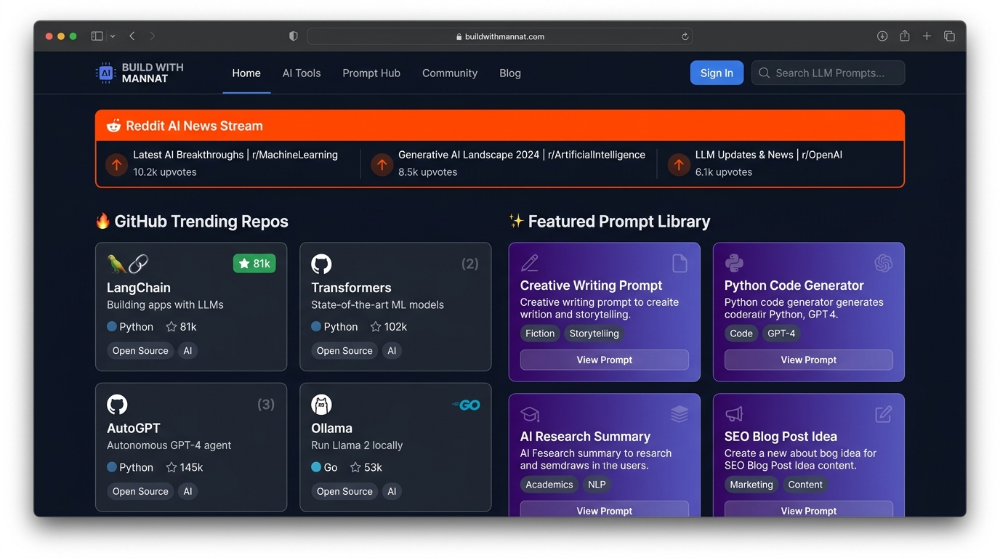

# ⚡ Build with Mannat | AI Tools, LLM Mental Models & Developer Workflows

> A modern, full-stack interactive hub for AI engineering, prompt design, live Reddit AI scraping, trending open-source GitHub repositories, and Python developer workflows.


https://vercel.com/mannat-0776s-projects/build-with-mannat/5uaB7MPifxG3Mb86Ym6pq9ErkJQx
---

## ✨ Features

### 🚀 1. Live Reddit AI News Stream & Auto-Rotating Spotlight
* **Real-time Subreddit Scraping**: Dynamically fetches top AI news, breakthroughs, and discussions from `r/ArtificialInteligence`, `r/MachineLearning`, `r/LocalLLaMA`, `r/ChatGPT`, `r/OpenAI`, and `r/Singularity`.
* **Auto-Rotating Spotlight Banner**: Top featured banner cycles through scraped posts every 6 seconds with custom timer controls, pause/play, next/prev, and random shuffle buttons.
* **Gemini Executive Summaries**: 1-click **"Summarize with Gemini"** integration generating concise 2-bullet executive takeaways for any Reddit thread.

### ⭐ 2. Useful & High-Star GitHub AI Repositories
* **Trending Repos Feed**: Discovers top starred open-source projects across key categories (LLMs & Inference, Autonomous Agents, RAG & Vector DBs, Gemini & Google AI, Python AI Tools).
* **Random Repo Spotlight**: 1-click random repository picker to discover high-value tools on demand.
* **Developer Quick Actions**: 1-click `git clone` command copying to clipboard, star/fork counts, topic tags, and direct repository links.

### 🎨 3. Persistent Theme Preference (Dark & High-Contrast Light)
* **Custom Theme Toggle**: Switch seamlessly between the default dark atmosphere and a high-contrast light theme.
* **LocalStorage Persistence**: Stores user selection (`localStorage.setItem('theme', ...)`), restoring preference across browser reloads.

### 💡 4. Interactive Prompt Library & Gemini AI Assistant
* **Categorized Prompt Cards**: Curated prompts for Code Architecture, System Design, Refactoring, Prompt Engineering, and Debugging.
* **Built-in Gemini Assistant Modal**: Custom modal dialog powered by Google GenAI (`@google/genai`) to test, refine, and execute prompts interactively.

### 🧠 5. LLM Mental Models Visualizer
* Visual cards explaining core concepts like *Chain-of-Thought (CoT)*, *Retrieval-Augmented Generation (RAG)*, *ReAct Pattern*, *Tree-of-Thoughts (ToT)*, and *In-Context Learning*.

### 🐍 6. Python AI Workflows & Code Playground
* Interactive Python code snippets and workflow templates for Gemini API streaming, function calling, vector embeddings, and multi-agent execution with copy-to-clipboard functionality.

---

## 🛠️ Tech Stack

* **Frontend**: React 18, TypeScript, Tailwind CSS, Lucide React Icons, Motion animations.
* **Backend**: Express.js server (`server.ts`) running Node.js / `tsx`.
* **AI Engine**: `@google/genai` TypeScript SDK (Gemini 3.8 Flash).
* **Build System**: Vite, Esbuild, TypeScript.

---

## 🚀 Getting Started

### Prerequisites
- Node.js 18+ installed

### Installation & Setup

1. **Clone the repository**:
   ```bash
   git clone https://github.com/buildwithmannat/build-with-mannat.git
   cd build-with-mannat
   ```

2. **Install dependencies**:
   ```bash
   npm install
   ```

3. **Configure Environment Variables**:
   Create a `.env` file (or set environment variables):
   ```env
   GEMINI_API_KEY=your_gemini_api_key_here
   ```

4. **Run Development Server**:
   ```bash
   npm run dev
   ```
   The app will run locally at `http://localhost:3000`.

5. **Build for Production**:
   ```bash
   npm run build
   npm start
   ```

---

## 📁 Project Structure

```
├── server.ts                       # Backend Express server & Reddit/GitHub API proxy endpoints
├── index.html                      # HTML entry point with meta tags & Google fonts
├── src/
│   ├── App.tsx                     # Main application layout component
│   ├── main.tsx                    # React DOM root entry point
│   ├── index.css                   # Tailwind CSS global styles & light theme overrides
│   ├── types.ts                    # Global TypeScript interfaces & types
│   ├── hooks/
│   │   └── useTheme.ts             # Theme preference hook with localStorage persistence
│   ├── components/
│   │   ├── Navbar.tsx              # Fixed navigation bar with mobile menu & ThemeToggle
│   │   ├── ThemeToggle.tsx         # Sun/Moon theme toggle button
│   │   ├── ScrollProgressBar.tsx   # Top viewport scroll progress bar
│   │   ├── HeroSection.tsx         # Hero banner & primary CTA controls
│   │   ├── RedditAiNewsSection.tsx # Live Reddit scraper & auto-rotating spotlight
│   │   ├── GithubTrendingSection.tsx# High-star GitHub AI repositories section
│   │   ├── InteractivePromptLibrary.tsx # Prompt cards & filter tabs
│   │   ├── LLMMentalModelsVisualizer.tsx# Visual guide to LLM concepts
│   │   ├── PythonWorkflowsPlayground.tsx# Python code snippets playground
│   │   ├── LinkedInFeedSection.tsx # LinkedIn posts feed & activity stream
│   │   ├── AiPromptGeneratorModal.tsx # Gemini AI assistant popup modal
│   │   └── Footer.tsx              # Footer section
│   └── assets/
│       └── images/                 # Screenshot assets
└── package.json                    # Dependencies & build scripts
```

---

## 📄 License

Apache-2.0 License © 2026 Build with Mannat
